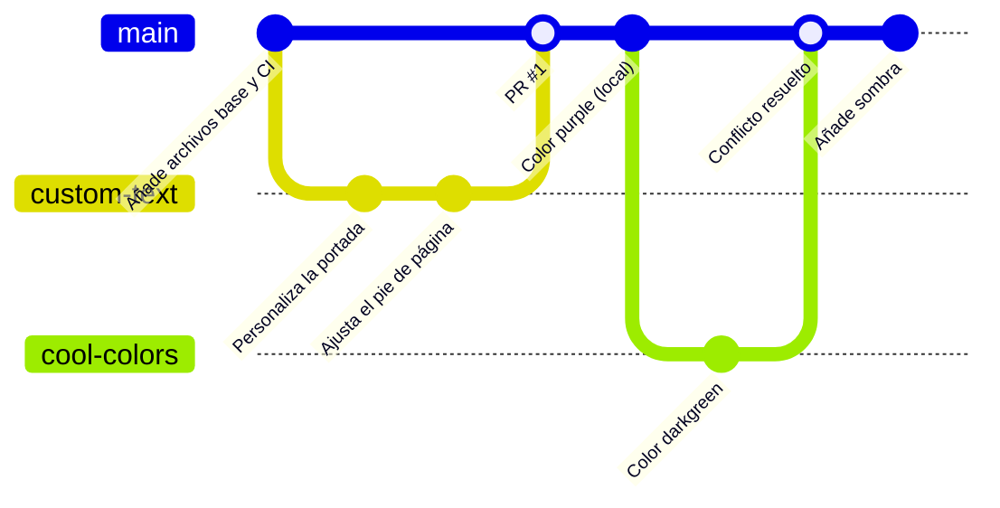

# git-work — Repositorio colaborativo Git

Repositorio de práctica del flujo colaborativo: fork/espejo, issue, rama, PR, conflicto, etiqueta y release.

## Índice
- [git-work — Repositorio colaborativo Git](#git-work--repositorio-colaborativo-git)
  - [Índice](#índice)
  - [Entorno e instalación](#entorno-e-instalación)
  - [Configuración](#configuración)
  - [Comprobación](#comprobación)
  - [Problemas encontrados y solución](#problemas-encontrados-y-solución)
  - [Repositorio remoto](#repositorio-remoto)

## Entorno e instalación
Git (versión), gh, cuenta de GitHub, SSH. Pasos: `git clone`, abrir `index.html`.

## Configuración
Autoría con `git config --local`. Remotos: `origin`, `espejo` y `upstream`. Cambios en líneas 10 y 11 de `css/cover.css`. Modalidad individual: `git-work-espejo` hace el papel de user2.

## Comprobación
Salidas reales de `git log --oneline --graph --all`, `git remote -v`, `git tag`, autoría, `git status`, `gh pr list`, `gh issue list` y `gh release list`. Detalle completo en `comprobaciones.txt`.

## Problemas encontrados y solución
| Problema | Causa | Solución |
|---|---|---|
| Conflicto en `css/cover.css` | Línea 10 modificada en `main` (purple) y en `cool-colors` (darkgreen) | Resolución manual conservando `darkgreen` y commit de fusión |
| (añade los que hayas tenido reales) | | |

## Repositorio remoto
Enlace público: https://github.com/TU_USUARIO/git-work
Pull request principal: https://github.com/TU_USUARIO/git-work/pull/1
Segundo PR: https://github.com/TU_USUARIO/git-work/pull/2
Release: https://github.com/TU_USUARIO/git-work/releases/tag/0.1.0